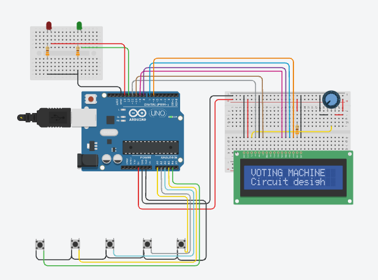

# 🗳️ Smart Electronic Voting Machine

An Arduino Uno based Electronic Voting Machine (EVM) that securely records votes for multiple candidates and displays live voting information and final election results on a 16×2 LCD display.

This project simulates the basic functionality of an electronic voting system used in secure elections while demonstrating embedded systems programming, digital input handling, and hardware interfacing.

---

## Project Preview



---

## Demo

🎥 Simulation Video

images/simulation_EVM.mp4

---

# Overview

The Smart Electronic Voting Machine allows users to cast a vote for one of four candidates using dedicated push buttons. Each vote is counted only once per button press and stored inside the Arduino during execution.

The LCD provides real-time instructions, voting confirmation, and displays the final vote count for all candidates after the election process.

LED indicators provide visual feedback during voting operations.

---

# Features

- Four candidate voting system
- Secure vote counting
- One-button vote casting
- 16×2 LCD user interface
- Live voting status display
- Final vote result display
- LED status indication
- Arduino Uno based implementation
- Simulated in Tinkercad

---

# Components Used

- Arduino Uno
- 16×2 LCD Display
- 5 Push Buttons
- LEDs
- Resistors
- Breadboard
- Jumper Wires
- Potentiometer (LCD Contrast)

---

# Working Principle

1. The Arduino initializes the LCD and all input buttons.
2. The LCD displays voting instructions.
3. The voter presses the button corresponding to a candidate.
4. The Arduino increments that candidate's vote count.
5. The LCD confirms successful vote registration.
6. LED indicators provide voting feedback.
7. After voting is completed, the result button displays the total votes received by each candidate.
8. The system continues running until reset.

---

# Candidate Layout

| Button | Candidate |
|---------|-----------|
| Button 1 | BJP |
| Button 2 | INC |
| Button 3 | AAP |
| Button 4 | OTH |
| Button 5 | Display Result |

---

# Circuit Description

The system consists of an Arduino Uno connected to:

- Five push buttons for user input
- 16×2 LCD display operating in 4-bit mode
- Potentiometer for LCD contrast adjustment
- LED indicators
- External resistors for stable digital inputs

The Arduino continuously monitors button presses, updates vote counts, and refreshes the LCD accordingly.

---

# Skills Demonstrated

- Embedded C Programming
- Arduino Programming
- Embedded Systems Design
- Digital Electronics
- LCD Interfacing
- Push Button Interfacing
- Input Debouncing
- Hardware Interfacing
- Real-Time Embedded Programming

---

# Applications

- Electronic Voting Machines
- College Election Systems
- Classroom Demonstrations
- Embedded Systems Learning
- Digital Electronics Laboratory
- Secure Voting Prototypes

---

# Future Improvements

- Password protected administrator mode
- EEPROM vote storage
- Fingerprint authentication
- RFID based voter identification
- GSM based result transmission
- IoT enabled voting system
- Biometric verification
- Cloud database integration

---

# Repository Structure

```
Smart-Electronic-Voting-Machine
│
├── code
│   └── Electronic_Voting_Machine.ino
│
├── images
│   ├── circuit.png
│   ├── output.png
│   └── simulation.mp4
│
├── README.md
└── LICENSE
```
